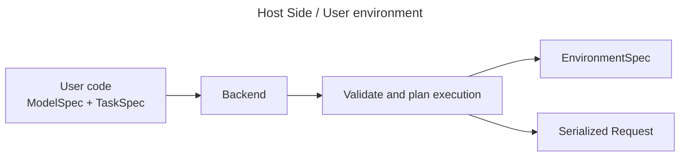
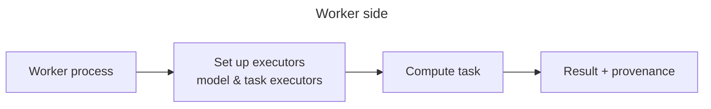

# Introduction

## TL;DR

- The purpose of `atomforge` is to easily & reproducibly run atomistic calculations in isolated environments. 
- There are many pretrained machine learning interatomic potentials, each with their own dependencies which makes manual environment resolution tricky when wanting to work with more than one model. 
- `atomforge` can create and run calculations in isolated environments avoiding conflicts and making it easier to work with a variety of models. 
- `atomforge` has a plugin system for both models and tasks making it simple to use and extend with more models or additional tasks. 

## Atomforge as a diagram

`atomforge` has a host and a worker side - each of these are depicted below

The backend uses the `EnvironmentSpec` to create or reuse an isolated worker environment, then sends a serialized request and receives the result.

## Core Concepts

### `TaskSpec`

A `TaskSpec` describes what should be computed. For example, a single-point task asks for properties such as energy, forces, or stress for a structure. Tasks can also be more complex such as structure optimization. A `TaskSpec` does not define how the computation is done, that is done by an accompanying `TaskExecutor` that is only instantiated on the worker process. 

### `ModelSpec`

`ModelSpec` describes which model configuration should be used. It is intentionally lightweight and serializable so it can be sent across the subprocess boundary. Like for tasks, the `ModelSpec` itself contains no methods to compute anything, that is handled by the accompanying `ModelExecutor` that is only instantiated on the worker process. This means that no model dependencies need to be loaded on the host process. 

### `EnvironmentSpec`

Models and tasks define dependencies in that `atomforge` resolves into an `EnvironmentSpec` used to create or reuse an isolated environment rather than importing model dependencies into the host process. 

### `Backend`

A backend is responsible for planning and executing the task. The backend validates whether the task and model are compatible, resolves an environment, starts or reuses a worker process, and returns a result.

### `Result` / `Provenance`

Each task defines a specific serializable result object that is created on the worker process and returned to the host. Along with the result `atomforge` creates a `Provenance` detailing the environment, model and task specifications to aid with reproducibility.

## Environment Isolation

`atomforge` is designed around environment isolation to avoid dependency conflicts, avoid manual 
environment management and thereby enable reproducible use of modern machine learning interatomic potentials. 

## Comparison with `ase`/`pymatgen`

The purpose of `atomforge`is orchestration, so models or task in `atomforge` can and often do 
use `ase` or `pymatgen`. `atomforge` does not have any core functionality for setting up, manipulating structures, these are best done using `ase` or `pymatgen`. Atomforge's `StructureData`-class does not have anywhere near the functionality of `ase.Atoms` but is just a lightweight serializable representation of atomistic structures. 

In `ase` a `Calculator` defines both the how and the what of a calculation. In `atomforge`
this is split into the `ModelSpec` and the `ModelExecutor`. The `ModelSpec` can be compared to `Calculator.__init__` while a `ModelExecutor` is comparable to `Calculator.calculate(...)`. This distinction is what makes it possible to avoid importing model specific dependencies in the host environment. 

